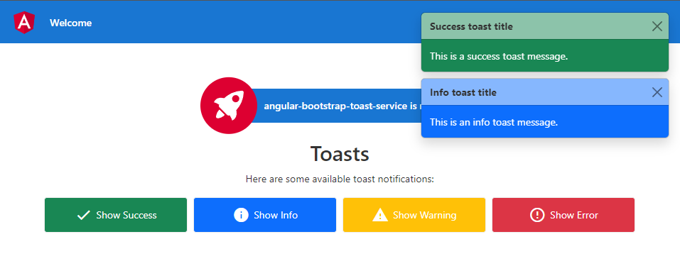

# Issue creating a toaster in angular 17 using standalone components.

I am trying to add a bootstrap toaster to my angular project. I am using angular 17 with standalone components.

I am trying to follow what was done in [this github repository](https://github.com/svierk/angular-bootstrap-toast-service/blob/main/src/app/services/toast.service.ts) but my project is standalone.

Running ng serve is successful but when I am trying to access http://localhost:4200/ I get the following error

```
[vite] Internal server error: document is not defined
at enableDismissTrigger (D:\dev\git-2.0\base-templates\angular\angular-bootstrap-5-base\node_modules\bootstrap\dist\js\bootstrap.esm.js:802:19)
at eval (D:\dev\git-2.0\base-templates\angular\angular-bootstrap-5-base\node_modules\bootstrap\dist\js\bootstrap.esm.js:884:1)
at async instantiateModule (file:///D:/dev/git-2.0/base-templates/angular/angular-bootstrap-5-base/node_modules/vite/dist/node/chunks/dep-G-px366b.js:54758:9) (x6)
```

I tried asking for help on this issue on [stackoverflow](https://stackoverflow.com/questions/78215920/error-adding-bootstrap-5-toaster-to-angular-17-as-standalone-components).

The following steps was done to create this

* A new ng new project_name
* npm i bootstrap
* npm i @types/bootstrap --save-dev
* a [toast component](src/app/components/toast) added
* a [toaster component](src/app/components/toaster) added
* 2 [models](src/app/models) added
* a [service](src/app/services) added
* and the [main component](src/app/app.component.html) has the main buttons that triggers the toasters

It should look something like this:



# Solution

[Server side rendering (SSR)](https://angular.io/guide/ssr) with bootstrap does not work hand in hand. Not sure if there are a way to still use it with SSR.
But for now I disabled SSR by following the steps on [this](https://www.reddit.com/r/Angular2/comments/1apc511/how_can_i_turn_off_ssr_in_angular_17/) site:

* Rm main.server.ts
* Rm server.ts
* Rm src/app/app.config.server.ts
* Remove these keys from architect in angular.json
```typescript
        "server": "src/main.server.ts",
        "prerender": true,
        "ssr": {
            "entry": "server.ts"
        }
```
* Remove these from tsconfig.app.json
  * files -> "src/main.server.ts"
  * types: [ "node" ] becomes "types": []
* npm uninstall @angular/ssr express @angular/platform-server
* npm uninstall -D @types/express @types/node
