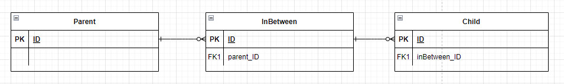

# What do I want to do

I have 3 tables having a one-to-many relationship with one another:



I am creating the middle `InBetween` entity with the linked side entities. 
When I am persisting the middle entity I want to insert all 3 at once.

```java
final Parent parentInstance = new Parent();
final InBetween inBetweenInstance = new InBetween(parentInstance);      // Telling it about the parent
final Child childInstance = new Child(inBetweenInstance);               // Telling it about the InBetween
dbService.saveInBetween(inBetweenInstance);
```
So effectively I told each `Many-relationship` entity about its parent. But the parent `One-relationship` entity does not know about the children.
I know with hibernate there is this bidirectional relations where the one entity knows about the other vice versa.

The `dbService.saveInBetween` is using the `InBetween` entity class that extends `PanacheEntityBase` to persist it to the DB.
```java
@Transactional
public void saveInBetween(InBetween inBetween) {
    InBetween.persist(inBetween);
}
```

# What is the problem

Upon retrieval of the `InBetween` records, by calling the `InBetween.listAll()` method, I get the `Parent` entities back but not the `Child`ren. 
If I look in the database nothing was inserted into the `child` table.

If I change the code to tell the `InBetween` instance to also know about the `Child`, thus so both know about one another it works:

```java
final Parent parentInstance = new Parent();
final InBetween inBetweenInstance = new InBetween(parentInstance);

// Both the Child and InBetween instances know about each other now
final Child childInstance = new Child(inBetweenInstance);               
inBetweenInstance.setChildren(List.of(childInstance));                  //Added this
        
dbService.saveInBetween(inBetweenInstance);
```

I did not tell the `Parent` about the `InBetween` instance but I do need to do the same for with the `child`.
My question is why does it differ and what is the correct approach in doing it?
